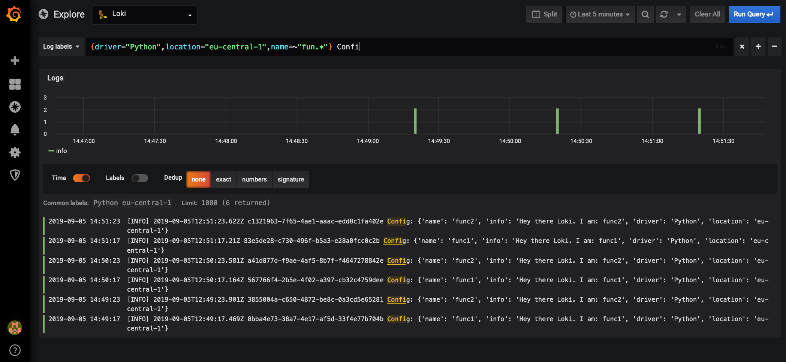

# CloudWatch Loki Logging Example
Simple demo project to demonstrate how CloudWatch logs can be shipped to Grafanas [Loki](https://grafana.com/loki "Loki Homepage") logging backend.  

## Idea
The idea is to create a lambda function which registers a trigger for certain CloudWatch log groups. The function is trigger for all new log entries and forwards
the entries to Loki. To enabled fine grained filter functionality in Loki, log groups are enriched with AWS tags. The AWS tags are transparently forwarded
to Loki as labels.

## Architecture


## Prerequisites  
- AWS Account
- AWC CLI User with the following permissions:
    - Lambda full Access
    - IAM read access
    - CloudWatch logs full access
    - CloudWatch events full access
- A IAM Role with name "**loki-shipper**" for the loki-shipper lambda function with the following
    -  CloudWatch logs full access
- Install virtualenv. [Link](https://virtualenv.pypa.io/en/stable/installation/)
- Ensure aws credentials are in place. The Demo CLI utilizes boto3 and thus relies on the credential.
  [link](https://boto3.amazonaws.com/v1/documentation/api/latest/guide/configuration.html)

### Install
- Clone this repository
- Install Loki and Grafana on a host which is reachable from the internet.
    - Copy docker-compose file to host, and run it.
    ```bash
    docker-compose up
    ```
    - Open Grafana UI http://<host-ip>:3000
    - Configure Loki datasource in Grafana() [link](https://grafana.com/docs/features/datasources/loki/)
    - If deployed with docker-compose, the Loki endpoint is **http://loki:3100**
    - Ensure ports 3000 and 3100 are reachable from the internet
    
- Setup the virtual environment on your box
    ```bash
    source setup.rc
    ```  

## Attach Loki shipper to existing Application Logs

- Start Loki Shipper

    ```bash
    # Start the shipper lambda function
    (venv)$ python demo/cli.py -p <aws.profile> -r <aws-region> shipper -l http://<host-ip>:3100 start
    Created Lambda: loki-shipper
    ```

- Attach log group to loki-shipper
    ```bash
    (venv)$ python demo/cli.py -p <aws.profile> -r <aws-region>  attach --tags "tag1=tag1value" -t "tag2=tag2value" <log-group-to-be-shipped-to-loki>
    Created/Updated LogGroup: <log-group-to-be-shipped-to-loki>
    Created log subscription for <log-group-to-be-shipped-to-loki>
    ```
 
- Stop Loki Shipper
    ```bash
    # Start the shipper lambda function
    (venv)$ python demo/cli.py -p <aws.profile> -r <aws-region> shipper stop
    Stopped Lambda Function: loki-shipper
    ```

## Full Demo
For demonstration purposes we'll deploy two continuously invoked demo lambdas to produce log entries in CloudWatch. CloudWatch events are used to 
schedule the lambdas. 

In addition a **loki-shipper** lambda which subscribes to the demo lambdas log groups.
In the following it is demonstrated how the demo can be installed and started.

The demo is started with the provided python CLI. 

- Start Demo
    ````bash
    (venv)$ python demo/cli.py -p <aws.profile> -r <aws-region>  demo -l http://<host-ip>:3100  start   
    Starting lambda: loki-shipper
    Created Lambda: loki-shipper
    Created/Updated LogGroup: /aws/lambda/demofunc-func1
    Starting lambda: demofunc-func1
    Updated Lambda: demofunc-func1
    Created log subscription for /aws/lambda/demofunc-func1
    Created/Updated LogGroup: /aws/lambda/demofunc-func2
    Starting lambda: demofunc-func2
    Updated Lambda: demofunc-func2
    Created log subscription for /aws/lambda/demofunc-func2
    Demo start
    ````
- Stop Demo
    ````bash
    (venv)$ cd scripts
    (venv)$ python cli.py demo stop
    Demo stop
    ````


## Grafana Loki UI
Now visit the Explore tab at http://<host-ip>:3000 and you should see something similar to:  



 